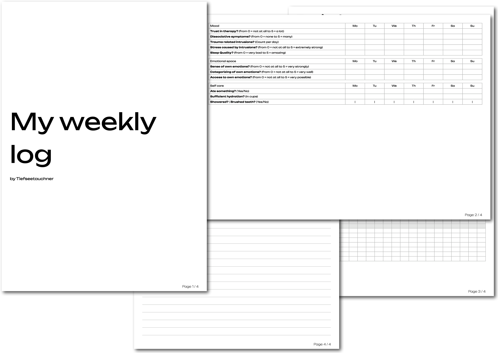

# TiefGogy



TiefGogy aims to be a resource to create and design worksheets for different kinds of fields. From therapy over pedagogy to architecting software solutions, everything\* is covered!

\* Barely anything.

## Usage

To use TiefGogy with the Typst web app, choose “Start from template” and select TiefGogy.

To import the package manually in your Typst project, use:

```typst
#import "@preview/tiefgogy:0.1.0": *
```

***TODO***

## License and Contributions

TiefGogy is currently under semi active development. Feedback, bug reports, and suggestions are welcome. Please open an issue or contribute via pull requests if you have ideas for improvement.

This package is released under the MIT License.
